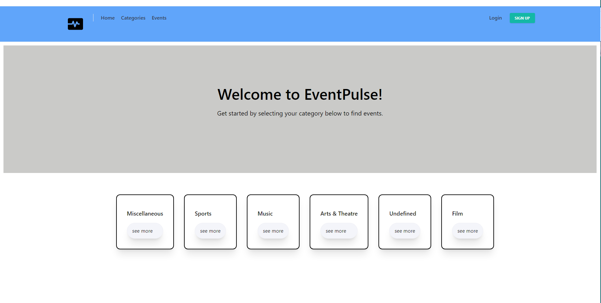
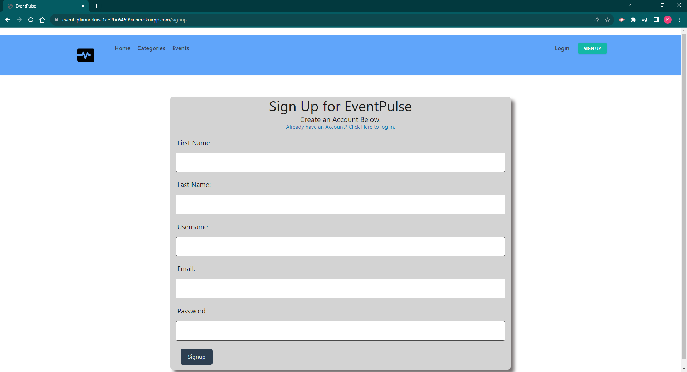
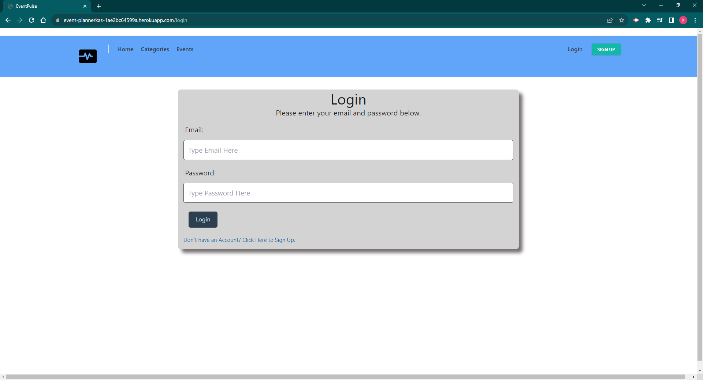
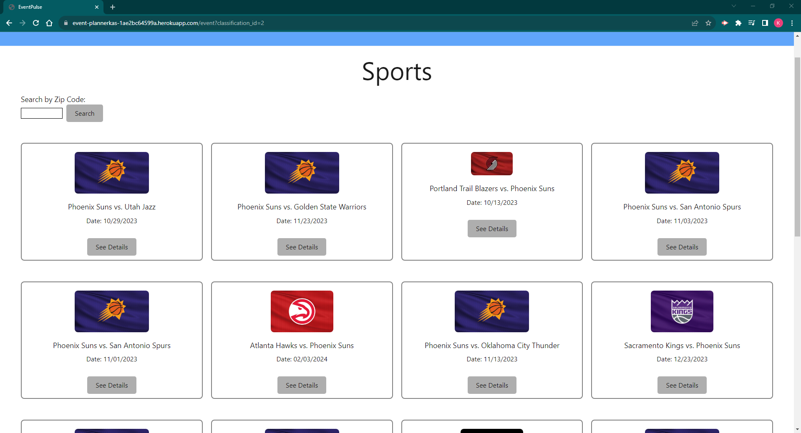
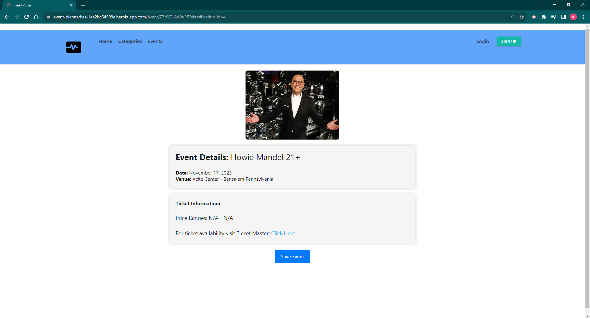
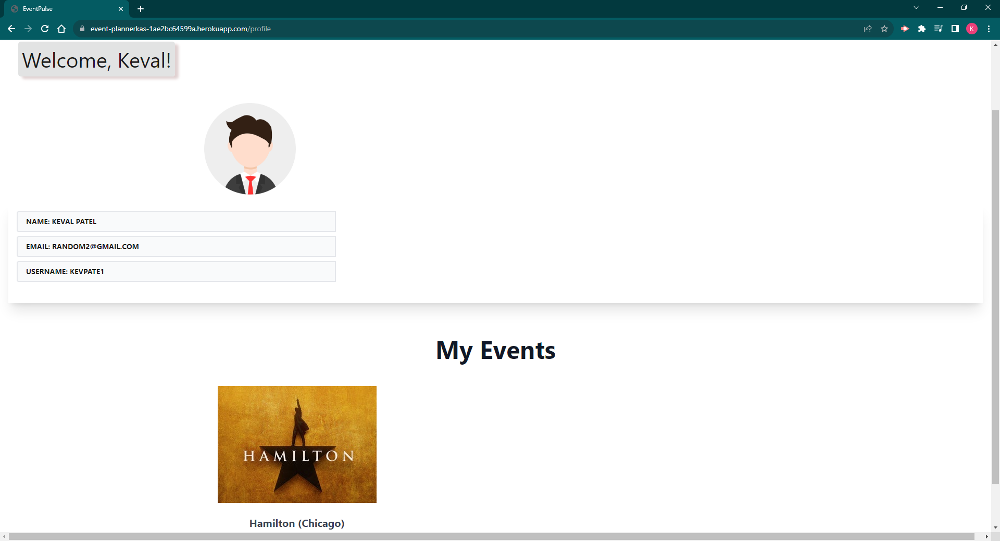

# Event-Pulse   

## Description

Event Pulse is a web application that provides users with the ability to look up events based on a number of different categories and their location. The application was developed in order to allow users to find events that they want to attend or just for browsing purposes. Additionally, it allows users to create profiles where they can save events so that they can revisit them at another time or keep track of events that they are already planning to attend. Further, users also have the ability to purchase tickets from a 3rd-party vendor or just check ticket prices and seat maps for tickets that are available.  This application was built to start a new platform that gathers event information for querying purposes. As developers, we learned a lot about how to built out back-end services and how to connect them with the front-end client facing view. 

## Usage

In order to use this application, you will first need to use this link [HERE](https://event-plannerkas-1ae2bc64599a.herokuapp.com/) to hit the landing page. You can see a screenshot of the landing page below.

From the landing page, you will see six categories to choose from. Clicking on the 'see more' button for any category will redirect you to a page that renders all the events for that particular category that are upcoming. However, first, we will visit the user profile creation avenue. From the landing page, you can click on the 'SIGN UP' button at the top right of the screen where you will be redirected to a page that asks for user information to signup for a profile. Below you can see a screen shot of the signup page.

The information you provide will be saved to a database where it will be accessed for anytime the user decides to sign in. Clicking the "Login" button from the homepage will take you to a login page that asks for your email and password. Below you can see a screenshot of the login page.

 The credentials are checked with the database to sign a user in. Error messages will be shown to the user if the email or password are incorrect. Now, moving on to selecting the category, you will be redirected to the category events page. Below you can see a screenshot of that the page for the sports category.
 
 

 From here you will see all the events for that particular category. You can click on any event and it will take you to an event page where you can find more information about the event and an external link to ticketmaster to purchase tickets. Below is a screenshot of an example of that page showing an event to see Howie Mendel.

  

 If you are logged in, you can also save the event. After saving an event, you can go to your profile by clicking the "My Profile" button after you login, and you will see "My Events" toward the bottom of the screen with all the events that you save. Below you will see the my events showing Hamilton saved as an event for a user.

## Credits 

As a group, we would like to give credit to our wonderful tutors who helped us through some rough patches. We would also, like to give credit to our teaching staff for answering all our questions. 

## License

MIT License

Copyright (c) [2023] [Keval Patel, Jocelin Amaya, Simon Magidenko]
        
Permission is hereby granted, free of charge, to any person obtaining a copy
of this software and associated documentation files (the "Software"), to deal
in the Software without restriction, including without limitation the rights
to use, copy, modify, merge, publish, distribute, sublicense, and/or sell
copies of the Software, and to permit persons to whom the Software is
furnished to do so, subject to the following conditions:

The above copyright notice and this permission notice shall be included in all
copies or substantial portions of the Software.

THE SOFTWARE IS PROVIDED "AS IS", WITHOUT WARRANTY OF ANY KIND, EXPRESS OR
IMPLIED, INCLUDING BUT NOT LIMITED TO THE WARRANTIES OF MERCHANTABILITY,
FITNESS FOR A PARTICULAR PURPOSE AND NONINFRINGEMENT. IN NO EVENT SHALL THE
AUTHORS OR COPYRIGHT HOLDERS BE LIABLE FOR ANY CLAIM, DAMAGES OR OTHER
LIABILITY, WHETHER IN AN ACTION OF CONTRACT, TORT OR OTHERWISE, ARISING FROM,
OUT OF OR IN CONNECTION WITH THE SOFTWARE OR THE USE OR OTHER DEALINGS IN THE
SOFTWARE.

## Questions

If you would like to reach out to me with any questions, you can email me directly at: [None](mailto:None)

Also, you can visit my github profile page [here](https://github.com/KevalPatel6, joceamayar, SimonMagidenko).